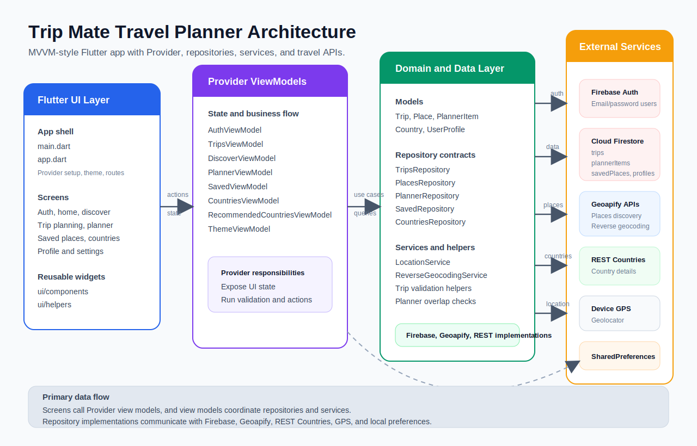

# Trip Mate Travel Planner

Trip Mate is a fully functional Flutter travel-planning application that helps users create trips, discover nearby places, save favorites, and organize a day-by-day itinerary without overlapping schedule items.

The app is built with an MVVM-style structure using Provider for state management, Firebase for authentication and cloud data storage, Geoapify for place discovery and reverse geocoding, REST Countries for country details, and Geolocator for device location.

## Tech Stack & Core Skills

- Flutter and Dart
- Provider state management
- Firebase Auth
- Cloud Firestore
- Geoapify Places and Reverse Geocoding APIs
- REST Countries API
- Geolocator
- Shared Preferences
- Flutter test

## Architecture & System Design

The project follows a layered MVVM-style structure, separating business logic from UI state:



```text
lib/
  main.dart                       App entry point
  app.dart                        Providers, theme, and root navigation
  data/
    models/                       Trip, Place, PlannerItem, Country, UserProfile
    repositories/                 Abstract repositories and API/Firebase implementations
    services/                     Location and reverse geocoding services
    helpers/                      Trip validation and overlap detection
    constants/                    Geoapify category mapping
  viewmodels/                     Business logic and UI state
  ui/
    screens/                      Feature screens
    components/                   Reusable widgets
    helpers/                      UI error handling
test/                             Unit and widget tests
```

**Data Model**
The application relies on the following core domain models to drive its business logic:
- `Trip`: city, country, dates, budget, interests, and active-trip status.
- `Place`: place metadata, category, address, website, phone, location, and distance.
- `PlannerItem`: scheduled place visit with date, start time, duration, and overlap checks.
- `Country`: country information from REST Countries, including flags, population, capital, languages, and currencies.
- `UserProfile`: user identity and profile information stored in Firestore.

**External Services**
Trip Mate seamlessly integrates several external services:
- **Firebase Auth:** user registration, login, and session state.
- **Cloud Firestore:** trips, saved places, planner items, and user profiles.
- **Geoapify:** nearby places, text search, category filtering, and reverse geocoding.
- **REST Countries:** country details and recommendations.
- **Device GPS:** location-based discovery and recommendations.

## Features

- **Authentication:** Email/password login and registration with Firebase Auth.
- **Trip profiles:** Create trips with country, city, travel dates, budget, and interests.
- **Place discovery:** Search nearby places by category using Geoapify Places API.
- **Saved places:** Save favorite places and access them later.
- **Day planner:** Add places to a daily schedule with date, start time, and duration.
- **Overlap prevention:** Detects conflicting planner time slots before saving.
- **Country recommendations:** Shows country suggestions and details using location and REST Countries data.
- **Profile and settings:** User profile editing, dark mode toggle, and app settings screens.
- **Validation and tests:** Includes unit tests for trip validation, overlap detection, and repository empty-state handling.

## Visual Overview

| Get Started | Login | Home | Discover |
| --- | --- | --- | --- |
|  |  |  |  |

| Place Details | Plan Trip | My Planner | Country Details |
| --- | --- | --- | --- |
|  |  |  |  |

## Requirements

If you wish to build and run this application locally:
- Flutter and Dart must be installed.
- Dependencies can be resolved using `flutter pub get`.
- A valid `google-services.json` must be placed in `android/app/` for Firebase integration.
- A Geoapify API key is required and should be passed via `--dart-define=GEOAPIFY_API_KEY=your-api-key` when running the app.
