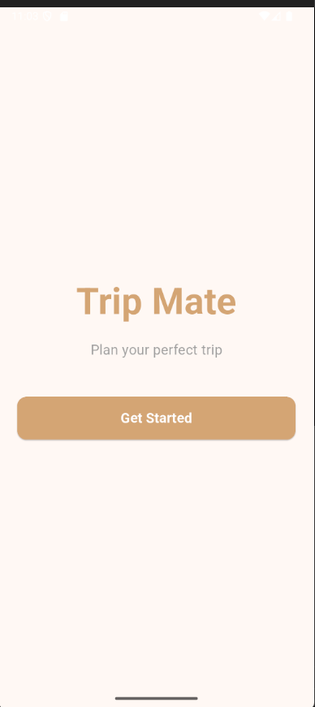
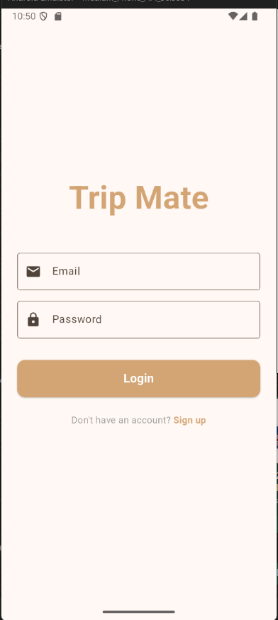
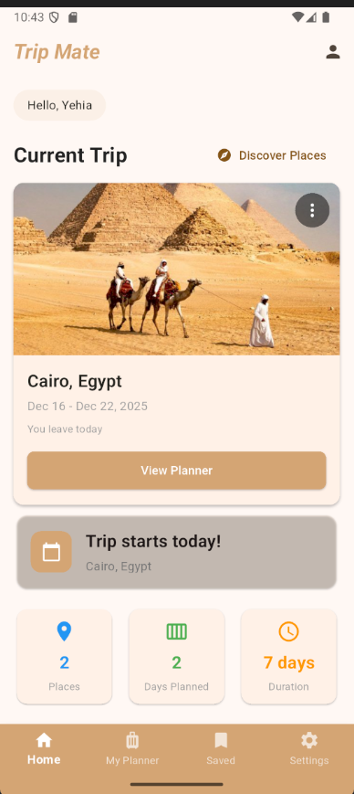
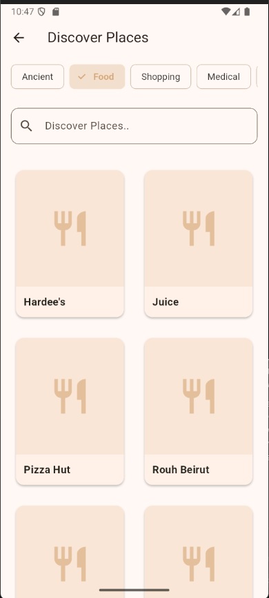
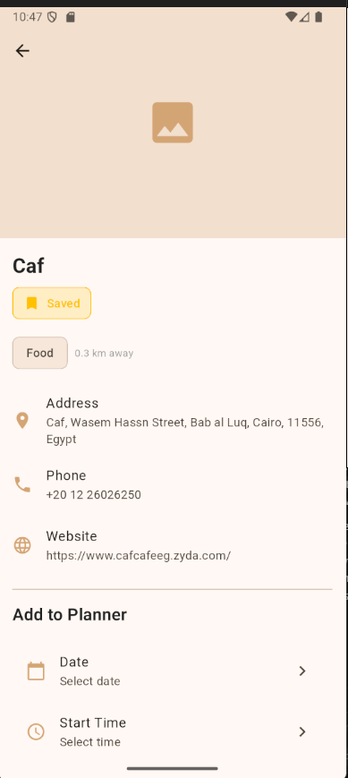
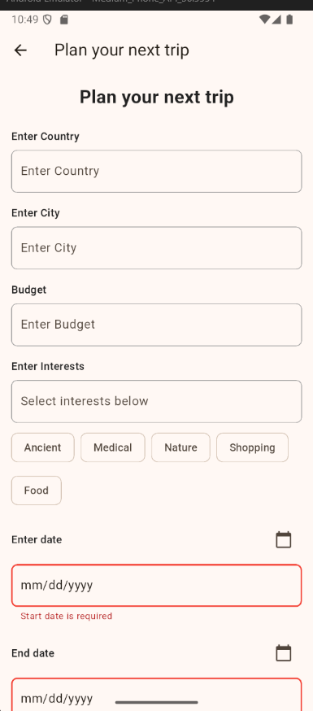
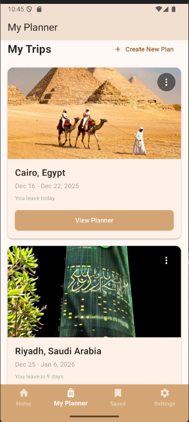
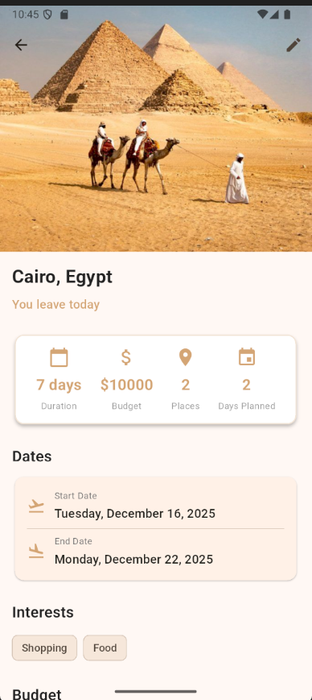

# Trip Mate Travel Planner

Trip Mate is a Flutter travel-planning app that helps users create trips, discover nearby places, save favorites, and organize a day-by-day itinerary without overlapping schedule items.

The app is built with an MVVM-style structure using Provider for state management, Firebase for authentication and cloud data storage, Geoapify for place discovery and reverse geocoding, REST Countries for country details, and Geolocator for device location.

## Features

- **Authentication:** Email/password login and registration with Firebase Auth.
- **Trip profiles:** Create trips with country, city, travel dates, budget, and interests.
- **Place discovery:** Search nearby places by category using Geoapify Places API.
- **Saved places:** Save favorite places and access them later.
- **Day planner:** Add places to a daily schedule with date, start time, and duration.
- **Overlap prevention:** Detects conflicting planner time slots before saving.
- **Country recommendations:** Shows country suggestions and details using location and REST Countries data.
- **Profile and settings:** User profile editing, dark mode toggle, and app settings screens.
- **Validation and tests:** Includes unit tests for trip validation, overlap detection, and repository empty-state handling.

## Screenshots

| Get Started | Login | Home | Discover |
| --- | --- | --- | --- |
|  |  |  |  |

| Place Details | Plan Trip | My Planner | Country Details |
| --- | --- | --- | --- |
|  |  |  |  |

## Tech Stack

- Flutter and Dart
- Provider state management
- Firebase Auth
- Cloud Firestore
- Geoapify Places and Reverse Geocoding APIs
- REST Countries API
- Geolocator
- Shared Preferences
- Flutter test

## Architecture

The project follows a layered MVVM-style structure:

```text
lib/
  main.dart                       App entry point
  app.dart                        Providers, theme, and root navigation
  data/
    models/                       Trip, Place, PlannerItem, Country, UserProfile
    repositories/                 Abstract repositories and API/Firebase implementations
    services/                     Location and reverse geocoding services
    helpers/                      Trip validation and overlap detection
    constants/                    Geoapify category mapping
  viewmodels/                     Business logic and UI state
  ui/
    screens/                      Feature screens
    components/                   Reusable widgets
    helpers/                      UI error handling
test/                             Unit and widget tests
```

## Data Model

The app uses these main domain models:

- `Trip`: city, country, dates, budget, interests, and active-trip status.
- `Place`: place metadata, category, address, website, phone, location, and distance.
- `PlannerItem`: scheduled place visit with date, start time, duration, and overlap checks.
- `Country`: country information from REST Countries, including flags, population, capital, languages, and currencies.
- `UserProfile`: user identity and profile information stored in Firestore.

## External Services

Trip Mate integrates with:

- **Firebase Auth:** user registration, login, and session state.
- **Cloud Firestore:** trips, saved places, planner items, and user profiles.
- **Geoapify:** nearby places, text search, category filtering, and reverse geocoding.
- **REST Countries:** country details and recommendations.
- **Device GPS:** location-based discovery and recommendations.

## Setup

Install dependencies:

```bash
flutter pub get
```

Create a Firebase project and add the Android app package used by this project:

```text
com.example.tripmate
```

Download the real Firebase Android config file and place it here:

```text
android/app/google-services.json
```

The real file is intentionally ignored by Git. Use `android/app/google-services.example.json` as the expected structure.

Create a local `.env` from the example file if you want a place to store local values:

```bash
cp .env.example .env
```

Run the app with the Geoapify key passed through Dart defines:

```bash
flutter run --dart-define=GEOAPIFY_API_KEY=your-geoapify-api-key
```

The app does not read `.env` automatically; `.env.example` documents the required local value, while `--dart-define` is what the Flutter runtime uses.

## Tests

Run the unit and widget tests:

```bash
flutter test
```

The included tests cover:

- trip form validation
- planner overlap detection
- empty-result repository behavior

## Security Notes

- Real `.env` files are ignored.
- `android/app/google-services.json` is ignored.
- `ios/Runner/GoogleService-Info.plist` is ignored.
- Geoapify API keys are supplied at runtime with `--dart-define`.
- Local SDK paths such as `android/local.properties` are ignored.

## Project Status

This is a portfolio version of the Trip Mate mobile application. The source code, screenshots, tests, and setup templates are included, while reports, private Firebase configuration, local SDK paths, and generated build artifacts are excluded.
